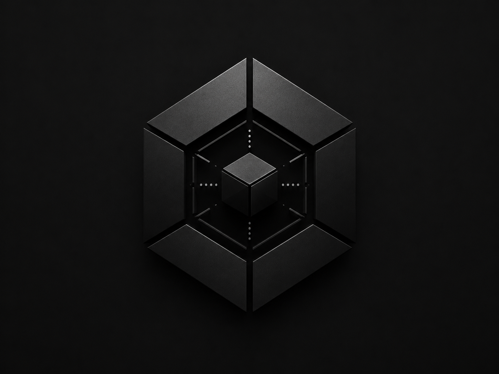

# PROJECT BLACKBOX

**Free - Offline - Yours!**
All your Files are yours Everything si stores as standard files `.md`, `.csv`, `.json` No propriatray file formats are used. your work is your own! There is no sense in locking it down. The Application itself is open source so you can ammend as you wish. Make something Awesome! 

Also there is no tracking, no cloud dependancies no nothing (check for yourself!) Computer software should be simple no need to add things or lock things down for no reason. I make it, you enjoy it. Form and Fucntion over unecercery gubbins! There is no subscrption. No sales pitch, no carpet pulling, Not even any donations! Just enjoy what I made if you find it useful that thats all I need. 

**PLEASE NOTE THIS SOFTWARE IS FREE IF YOU SEE ANY LISTING ACTING LIKE THIS ONE TRYING TO SELL IT TO YOU DONT FALL FOR IT!**
While people are free to copy this software make improvements and even sell their own versions, people who just rip the software do nothing to it and sell it, While legally the can, isnt fair and you should not pay for somthing that is free. If they add some cool new features or whatever that great good on them, But dont fall for a rip of this.

---

## What it does

PROJECT BLACKBOX is a desktop application for managing  workspaces on your local machine. It acts as a central aready for your mind.  Everything is stored as standard files -- notes are `.md`, tasks are `.csv`, snippets keep their native extensions. You can open any file with any editor.

- **Workspaces** -- Self-contained project folders. Each workspace holds its own notes, tasks, logs, snippets, and references.
- **Notes** -- Markdown editor with split view, tags, and backlinks (`[[Note Title]]` syntax).
- **Tasks** -- Kanban board with drag-and-drop between todo, doing, blocked, and done columns. Also supports a list view.
- **Logbook** -- Timestamped log entries with severity levels (info, warning, critical, success).
- **Snippets** -- Code storage with language detection. Files keep their native extension (`.py`, `.js`, `.tsx`, etc).
- **References** -- Link and organise external resources.
- **Timeline** -- Chronological event history across all workspace data.
- **Graph** -- Relationship map showing backlinks between notes.
- **Terminal** -- Built-in command palette with autocomplete. Supports commands for workspace management, note creation, search, and more.
- **Search** -- Full-text search across all items with tag filtering.

---

## Getting started

- Download the Installer from Releases
- Run Said Installer (It can be installed via User-Based Install or Machine-Wide install) (Enterprise Commandline Silent Install coming soon!)
- Open and Start by creating your own workspace

MIT &copy; [John Booth](https://github.com/JohnMBNet)

